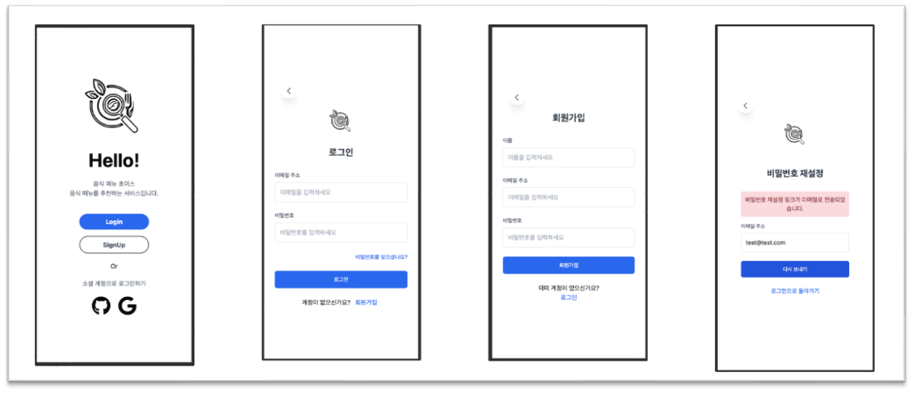
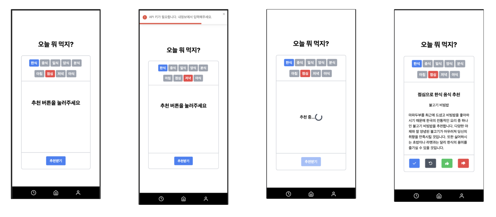
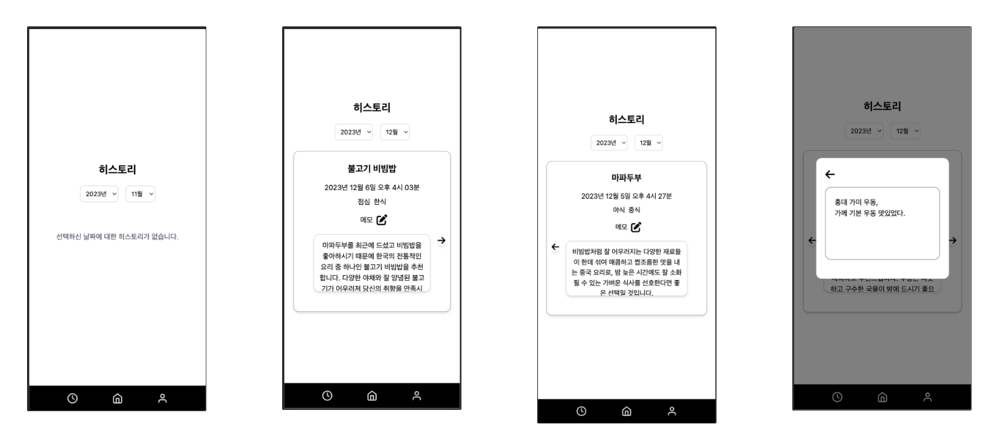

# 음식 메뉴 초이스

음식 메뉴를 추천하는 서비스 입니다.

GPT-API를 활용해 음식 메뉴를 추천합니다.

음식 종류(한식, 중식, 일식, 양식, 분식)과 시간대(아침, 점심, 저녁, 야식)에 맞는 음식을 추천받을 수 있습다.

최근에 먹은 음식 제외 기간과 좋아하는 음식, 싫어하는 음식을 설정 할 수 있습니다.

## 프로젝트 기간

2023-11-14 ~ 2023-12-6

## 기술 스택


## 화면 구성

### 인덱스 페이지, 로그인 페이지, 회원가입 페이지



- 소셜 로그인과 이메일 로그인이 가능합니다.

### 추천 페이지



- 음식 종류와 시간대를 골라 추천을 받을 수 있습니다.
- 버튼
  - 체크 : 히스토리로 기록
  - 새로고침 : 추천 다시 받기
  - 좋아요 : 좋아하는 음식 목록에 추가
  - 싫어요 : 싫어하는 음식 목록에 추가

### 히스토리 페이지



- 연도와 월을 고르면 해당하는 기록을 볼 수 있습니다.
- 메모 버튼을 누르면 모달창으로 기록할 수 있습니다.

### 내정보 페이지


- 닉네임, 프로필사진 변경
- 로그아웃
- 최근에 먹은 음식 제외기간 설정
- 좋아하는 음식 & 싫어하는 음식

## 개발 내용

### 회원

파이어베이스를 활용해 소셜 로그인과 이메일 로그인 기능 구현

### 음식 추천 기능

gpt4 api를 활용

```typescript
const prompt = `최근에 먹은 음식 : ${exclusionFoods}, 싫어하는 음식 : ${hateFoods}, 좋아하는 음식 : ${likeFoods}
      , json 형식 : {menu: "추천 음식 이름", description: "추천 이유 설명"}`;

const response = await openai.chat.completions.create({
  model: "gpt-4-1106-preview",
  messages: [
    {
      role: "system",
      content: prompt,
    },
    {
      role: "user",
      content: `최근에 음식과 싫어하는 음식을 제외하고 좋아하는
               음식을 보고 ${time}에 먹을 ${category}을 추천해주세요.`,
    },
  ],
  response_format: { type: "json_object" },
});
```

- 시스템 메세지로 최근에 먹은 음식, 싫어하는 음식, 좋아하는 음식, json형식을 지정
- 가장 최신 모델인 "gpt-4-1106-preview" 사용
- 추천 받기 버튼을 누르면 user가 질문하는 형식
  - "`최근에 음식과 싫어하는 음식을 제외하고 좋아하는
음식을 보고 ${time}에 먹을 ${category}을 추천해주세요.`"
- response_format을 json으로 지정하면 답변을 json으로 받는다.

### 데이터베이스

파이어베이스의 firestore 사용

DB 구조

- users(컬렉션)
  - uid(문서)
    - displayName : String
    - email : String
    - photoURL : String
    - foods(하위 컬렉션)
      - uid(문서)
        - exclusionPeriod : Number
        - hate : String Array
        - like : String Array
    - history(하위 컬렉션)
      - historyid(문서)
        - foodname : String
        - description : Sting
        - date : Date
        - category : String
        - time : String
        - memo : String
