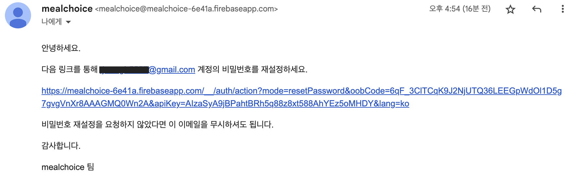

# 음식 메뉴 초이스

음식 메뉴를 추천하는 서비스 입니다.

GPT-API를 활용해 음식 메뉴를 추천합니다.

음식 종류(한식, 중식, 일식, 양식, 분식)과 시간대(아침, 점심, 저녁, 야식)에 맞는 음식을 추천받을 수 있습니다.

최근에 먹은 음식 제외 기간과 좋아하는 음식, 싫어하는 음식을 설정 할 수 있습니다.

이 서비스가 궁금하시다면 [mealchoice](https://go-mealchoice.vercel.app)를 클릭하세요.

## 프로젝트 기간

2023-11-14 ~ 2023-12-6

## 기술 스택


## 화면 구성

### 1. 인덱스 페이지, 회원 페이지


- 소셜 로그인과 이메일 로그인이 가능합니다.
- 비밀번호 재설정

### 2. 추천 페이지


- 음식 종류와 시간대를 골라 추천을 받을 수 있습니다.
- 버튼
  - 체크 : 히스토리로 기록
  - 새로고침 : 추천 다시 받기
  - 좋아요 : 좋아하는 음식 목록에 추가
  - 싫어요 : 싫어하는 음식 목록에 추가

### 3. 히스토리 페이지


- 연도와 월을 고르면 해당하는 기록을 볼 수 있습니다.
- 메모 버튼을 누르면 모달창으로 기록할 수 있습니다.

### 4. 내정보 페이지


- 닉네임, 프로필사진 변경
- 로그아웃
- 최근에 먹은 음식 제외기간 설정
- 좋아하는 음식 & 싫어하는 음식
- gpt-api key 입력

## 개발 내용

### 1. 로그인, 회원가입, 비밀번호 재설정

파이어베이스를 활용해 소셜 로그인, 이메일 로그인 기능



- 이메일 전송을 통한 비밀번호 재설정 기능

### 2. 음식 추천 기능

gpt4 api를 활용

```typescript
const prompt = `최근에 먹은 음식 : ${exclusionFoods}, 싫어하는 음식 : ${hateFoods}, 좋아하는 음식 : ${likeFoods}
      , json 형식 : {menu: "추천 음식 이름", description: "추천 이유 설명"}`;

const response = await openai.chat.completions.create({
  model: "gpt-4-1106-preview",
  messages: [
    {
      role: "system",
      content: prompt,
    },
    {
      role: "user",
      content: `최근에 음식과 싫어하는 음식을 제외하고 좋아하는
               음식을 보고 ${time}에 먹을 ${category}을 추천해주세요.`,
    },
  ],
  response_format: { type: "json_object" },
});
```

- 시스템 메세지로 최근에 먹은 음식, 싫어하는 음식, 좋아하는 음식, json 형식 지정
- 가장 최신 모델인 "gpt-4-1106-preview" 사용
- 추천 받기 버튼을 누르면 user가 질문하는 형식
  - "`최근에 음식과 싫어하는 음식을 제외하고 좋아하는
음식을 보고 ${time}에 먹을 ${category}을 추천해주세요.`"
- response_format을 json으로 지정하면 답변을 json으로 받는다.

### 3. 인증

투트랙(쿠키와 Bearer 토큰 )

- nextjs에서 getServerSideProps를 사용한다고 하면 토큰을 전달하지 못하는 문제가 있음
- 로그인 시, firebase에서 토큰을 가져와 쿠키를 설정
- getServerSideProps 경우에는 요청에 쿠키를 담고, 그 외 다른 경우에는 Bearer 토큰으로

### 4. AWS Lambda

- vercel의 배포에서 시간 limit가 존재하는데, 무료버전에서는 10초
- openai gpt api를 사용해 추천받는 api의 시간이 10초를 넘어가 작동하지 않는 문제 발생
- 클라이언트 사이드에서 gpt api 호출은 사용자에게 입력받은 api키를 DB에서 가져오기 때문에 보안상 서버 사이드에서 진행해야 한다고 판단
- 그래서 해당 api만 AWS Lambda로 교체
- serveless 프레임워크로 타입스크립트 AWS lambda를 배포
- Access-Control-Allow-Origin을 명시해 cors 문제 해결
- AWS Lambda code : <https://github.com/anc5557/aws_lambda/tree/main/foodRecommendation>

### 5. 데이터베이스

파이어베이스의 firestore 사용

DB 구조

- users(컬렉션)
  - uid(문서)
    - displayName : String
    - email : String
    - photoURL : String
    - apiKey : String
    - foods(하위 컬렉션)
      - uid(문서)
        - exclusionPeriod : Number
        - hate : String Array
        - like : String Array
    - history(하위 컬렉션)
      - historyid(문서)
        - foodname : String
        - description : Sting
        - date : Date
        - category : String
        - time : String
        - memo : String

### 6. 프로필 이미지 변경

firebase에 Storage 사용

파일 경로 : users/{uid}/profile-image.png

덮어쓰기로 만들어 한개의 uid당 한개의 프로필 이미지만 되도록 함.

### 7. 배포

vercel을 통해 배포.  
웹사이트 주소 : <https://go-mealchoice.vercel.app>  
git에 push하면 업데이트 가능.
